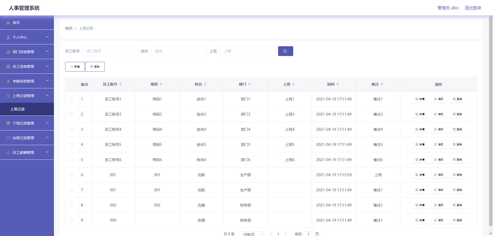

# 基于Springboot的人事系统

## Springboot-0066


## 技术栈

Springboot mybatisplus vue mysql maven


## 数据库表(10张)


## 功能介绍

```properties
管理员功能有个人中心，部门信息管理，员工信息管理，考勤信息管理，上班记录管理，下班记录管理，加班记录管理，员工薪酬管理等。

员工功能有个人中心，考勤信息管理，上班记录管理，下班记录管理，加班记录管理，员工薪酬管理等
```


## 图片

### 前台

### 后台





## 访问路径

### 前台

```properties

```

### 后台

```properties
http://localhost:8080/springboot9v464/admin/dist/index.html#/login

账号 abo
密码 abo
```


## 功能图


## 文档目录


## 打赏或交流


